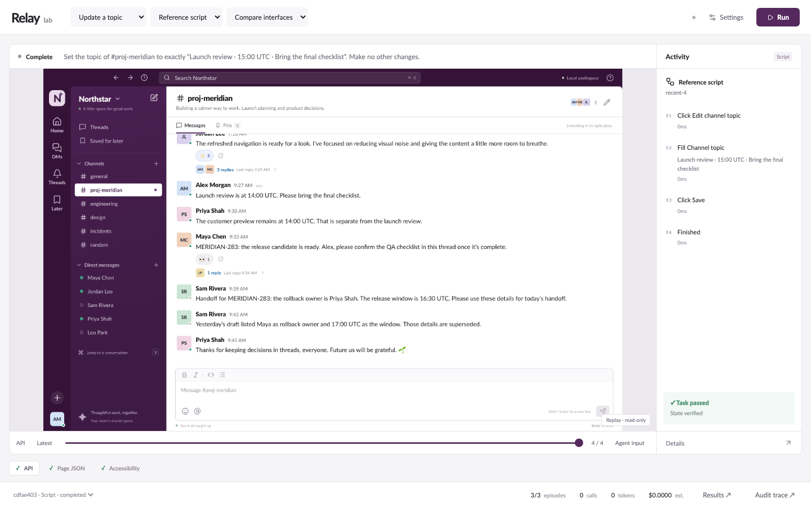
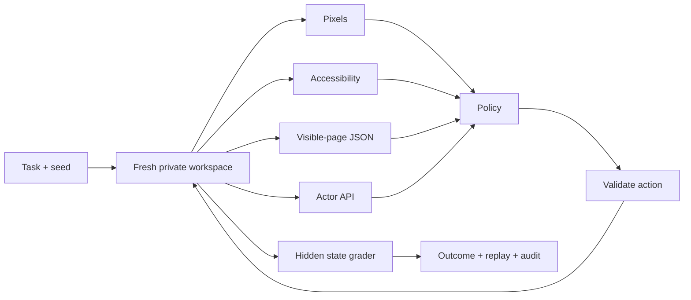

<div align="center">


**A Slack-like playground for computer-use agents.**

Real interactions. Isolated workspaces. Comparable runs. An inspectable audit trail.

[Get started](#run-locally) · [How it works](#one-task-four-interfaces) · [Evidence](docs/verification.md) · [Architecture](docs/architecture.md)


</div>

---

## The idea

Give an agent a small, realistic Slack workflow. Watch what it sees, what it tries,
and what actually changed. Then repeat the same task with a different model,
interface, documentation or history policy.

Relay separates **the workspace**, **the policy**, and **the evaluator**. A model
claiming “done” does not make a task pass—the final workspace state does.



### Small surface. Deep evidence.

| Watch                                   | Compare                               | Inspect                                  |
| --------------------------------------- | ------------------------------------- | ---------------------------------------- |
| Slack-like workspace and agent activity | Matched model/interface/context cells | Inputs, actions, responses and failures  |
| Select an episode and scrub its steps   | Outcome, latency, tokens and cost     | State mutations and deterministic checks |
| Keep controls out of the way            | Preserve errors and unattempted cells | JSON, JSONL and screenshot bundles       |

## Run locally

Requires **Node 24.13+**, npm, and Chromium installed through Playwright.

```sh
git clone https://github.com/Kevin-Liu-01/Relay.git
cd Relay
npm ci
npx playwright install chromium
npm run dev
```

In a second terminal:

```sh
npm run lab
```

Open **[Relay Lab → localhost:4330](http://localhost:4330)**.
Choose **Reference script → Update a topic → Compare interfaces → Run** for a
credential-free harness demonstration. Scripts are labeled; they are not model evidence.

To use Ramp Router, copy `.env.example` to a private `.env`, set
`RAMP_ROUTER_API_KEY`, and restart the lab. Discover your available model IDs,
confirm pricing, and start with one small task. Set a provider-side spend cap.
Never commit the key. [Model setup and budgets →](docs/benchmark-lab.md)

## One task, four interfaces



Cross interfaces with supplied `llms.txt` guidance and full versus bounded history.
The API condition changes both visibility and action granularity—it is **not**
equivalent to screenshot-based computer use. [Experiment contract →](docs/lab-plan.md)

## Six workflows

| Task               | What the agent must do                             |
| ------------------ | -------------------------------------------------- |
| Reply in a thread  | Search, disambiguate, reply under the right parent |
| Edit a message     | Update the original—not post a replacement         |
| Triage an incident | React to and pin the correct incident              |
| Send a handoff     | Read current facts and DM the right person         |
| Delete a draft     | Delete only the requested message                  |
| Update a topic     | Set the exact topic without collateral changes     |

## Every run has receipts

**Audit trace ↗** opens the complete recorded event trail. Search errors, inspect
model receipts, compare state mutations, and download the full bundle.

New runs record exact prepared requests, UTC timestamps, initial/final state and
hash-bound artifacts. Older captures are explicitly marked **partial** where those
fields were not recorded. Nothing is backfilled as if it were original evidence.
[Audit format, verification and limits →](docs/audit-trace.md)

## Verify it yourself

```sh
npm run verify                  # build, backend and browser checks
npm run experiment -- plan docs/lab-reference.json
```

The imported baseline has **50 backend checks and 24 browser checks**. Historical
live model smokes and their failures are retained as JSON evidence; they do not
establish a general leaderboard. Cosmetic seeds are not held-out task families.
No RL training or GPU experiment is claimed. [Full evidence chronology →](docs/verification.md)

## Under the hood

- **React + Vite** for the workspace and console.
- **Session-private SQLite** for deterministic fixture state and audit events.
- **Playwright** for isolated browser contexts and permission-limited actions.
- **Ramp Responses** for bounded model calls, with no hidden retries or fallback models.
- **Lucide + theSVG** for UI glyphs and provider/technology marks; local OFL Lato typography.

Public assets exclude the proprietary icon font and stock portraits used in the
private reference prototype. Brand marks identify integrations, not endorsement.
[Third-party notices →](THIRD_PARTY_NOTICES.md)

## Explore

[Architecture & isolation](docs/architecture.md) · [Research landscape](docs/research.md) ·
[Trainer interface](docs/trainer.md) · [Verification](docs/verification.md) ·
[Handoff](docs/handoff.md) · [Presentation](docs/presentation.html)

---

<div align="center">

Built by **[Kevin Liu](https://github.com/Kevin-Liu-01)**.<br />
A focused environment for studying agents—not an official Slack product.

</div>
