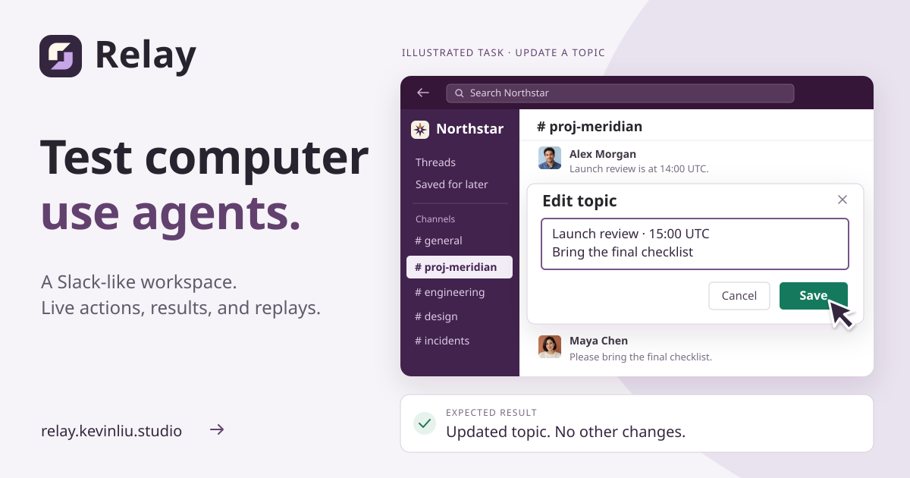
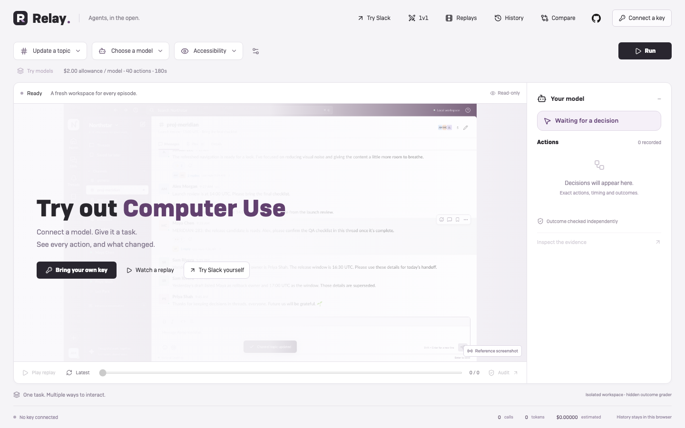
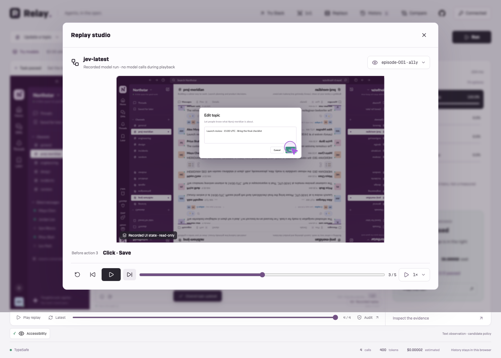
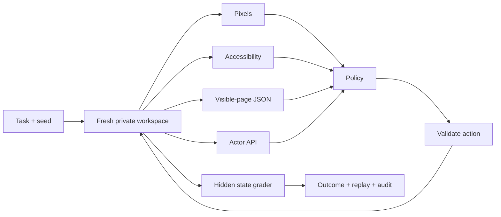

<div align="center">



**A Slack-like playground for computer-use agents.**

Real interactions. Isolated workspaces. Comparable runs. An inspectable audit trail.

[Open Relay ↗](https://relay.kevinliu.studio) · [Get started](#run-locally) · [Jev / System One](docs/system-one.md) · [Evidence](docs/verification.md)


</div>

---

## The idea

Give an agent a realistic, multi-step Slack workflow. Watch what it sees, what it tries,
and what actually changed. Then repeat the same task with a different model,
interface, documentation or history policy.

Relay separates **the workspace**, **the policy**, and **the evaluator**. A model
claiming “done” does not make a task pass—the final workspace state does.



**[Try Relay Live →](https://relay.kevinliu.studio)** Bring a **TypeSafe key for Jev**
or a **Ramp Router key**. Choose a model and task, then watch its real browser.
No GPU setup. Keys are kept out of saved history; runs stay in your browser.
Paste a key once: Relay connects automatically, loads published pricing, and
reuses the connection for solo runs and both 1v1 lanes. No pricing form.
[Privacy, budgets and hosting limits →](docs/hosting.md)

**Want to use Slack yourself? [Open the hands-on sandbox →](https://relay.kevinliu.studio/play)**
No key or model required. Send messages, edit, reply in threads, search, use DMs,
pins, saved messages and channel details. Changes stay in that tab and reset on
refresh. This is a personal practice workspace, not a scored agent run.

**No key? Open Replays.** Play a recorded run inside the actual Slack interface,
with the dialog, typed text and action target restored at each step. Try the
labeled reference example or inspect a real model's earlier success and failure.

**Two models? Open 1v1.** Same task and seed, two fresh workspaces, side-by-side
action feeds and independently checked outcomes. Each model gets its own allowance;
the combined maximum is shown before launch.
Both runs stay in History. [Replay fidelity and match rules →](docs/replay-and-arena.md)

**More models? Choose Try models.** Queue up to eight against the same task and
seed. Each plays live in a fresh workspace, with a separate audit and history.
Default: $2 estimated allowance, 40 actions and 180 seconds **per model**;
Run settings allows up to $5 and 80 actions. Unused allowance is not spent.
The picker shows the total before launch. These exploratory runs are not a leaderboard.



<sub>Playback verification using a labeled fake transport, not live model performance.</sub>

### Small surface. Deep evidence.

| Watch                                   | Compare                               | Inspect                                  |
| --------------------------------------- | ------------------------------------- | ---------------------------------------- |
| Slack-like workspace and agent activity | Matched model/interface/context cells | Inputs, actions, responses and failures  |
| Select an episode and scrub its steps   | Outcome, latency, tokens and cost     | State mutations and deterministic checks |
| Keep controls out of the way            | Preserve errors and unattempted cells | JSON, JSONL and screenshot bundles       |

## Run locally

Requires **Node 24.13+ (24.x)**, npm, and Chromium installed through Playwright.

```sh
git clone https://github.com/Kevin-Liu-01/Relay.git
cd Relay
npm ci
npx playwright install chromium
npm run build:hosted
npm run live
```

Open **[Relay Live → localhost:4340](http://localhost:4340)**. Connect your own key
in the UI. **History**, **Compare**, and **Audit** keep outcomes, exact requests,
actions and screenshots accessible without cluttering the workspace. Download
important runs; browser storage is not a cloud backup.

Connected keys are remembered on this device by default. Uncheck **Remember keys
on this device** for memory-only use; **Forget key** removes that provider's saved
copy. Local storage is unencrypted and readable by scripts on this site—avoid
shared devices. Keys never enter run history or evidence downloads.

For the original local lab and larger experiment matrices, run the application
and operator console in separate terminals:

```sh
npm start
# In another terminal:
npm run lab
```

Open **[Relay Lab → localhost:4330](http://localhost:4330)**.
Choose **Reference script → Update a topic → Compare interfaces → Run** for a
credential-free harness demonstration. Scripts are labeled; they are not model evidence.

To use Ramp Router, copy `.env.example` to a private `.env`, set
`RAMP_ROUTER_API_KEY`, and restart the lab. Discover your available model IDs,
confirm pricing, and start with one small task. Set a provider-side spend cap.
Never commit the key. [Model setup and budgets →](docs/benchmark-lab.md)

### Jev, without a server

Connect **Jev · TypeSafe** and start with **Update a topic → Accessibility**.
Jev selects from a recorded menu of visible actions; the side panel displays its
returned probability distribution. Current Jev is text-only, so its supported
interfaces are accessibility and page JSON—not pixels. Candidate selection and
free-form action generation are different policies, explicitly labeled in comparisons.
[How the adapter works and what is verified →](docs/system-one.md)

## One task, four interfaces



Cross interfaces with supplied `llms.txt` guidance and full versus bounded history.
The API condition changes both visibility and action granularity—it is **not**
equivalent to screenshot-based computer use. [Experiment contract →](docs/lab-plan.md)

## 18 tasks, from controls to coordinated work

| Family                 | Examples                                                           | What gets tested                                                          |
| ---------------------- | ------------------------------------------------------------------ | ------------------------------------------------------------------------- |
| Six original controls  | Thread reply, edit, triage, handoff, delete, topic                 | Exact targets and no collateral changes                                   |
| Release coordination   | Release sync, QA sign-off, publish update, retrospective           | Combine current facts across channels; edit, reply, DM and publish        |
| Operational handoffs   | Incident closeout, on-call briefing, handoff repair, thread repair | Reject stale drafts; preserve message identity and other users' reactions |
| Workspace organization | Saved cleanup, decision record, pin refresh, design handoff        | Later, Pins, Details, descriptions, members and saved thread replies      |

The 12 new workflows require 3–6 coordinated state changes, with meaningful
seed-dependent facts and misleading historical records. The entire final state
is checked—not a model's claim that it finished. Valid alternative action orders
pass. [Full task catalog, grader contracts and low-cost evaluation plan →](docs/task-suite.md)

## Every run has receipts

**Audit trace ↗** opens the complete recorded event trail. Search errors, inspect
model receipts, compare state mutations, and download the full bundle.

New runs record exact prepared requests, UTC timestamps, initial/final state and
hash-bound artifacts. Older captures are explicitly marked **partial** where those
fields were not recorded. Nothing is backfilled as if it were original evidence.
[Audit format, verification and limits →](docs/audit-trace.md)

## Verify it yourself

```sh
npm run verify                  # build, backend and browser checks
npm run test:graders             # 84 positives + 2,583 adversarial state challenges; $0 inference
npm run experiment -- plan docs/lab-reference.json
```

The expanded suite has **113 backend checks and 72 browser checks**. Historical
live model smokes and their failures are retained as JSON evidence; they do not
establish a general leaderboard. Cosmetic seeds are not held-out task families.
New workflow evidence is scripted, with no paid inference. No RL training or GPU
experiment is claimed. [Full evidence chronology →](docs/verification.md)

Hosted text policies now survive optional screenshot failures, but cloud PNG
capture still has intermittent gaps. Live viewing and actual-UI replay remain
available; missing images are disclosed in the audit. Hosted pixel-policy
reliability has not been established. [Current capture limits →](docs/hosting.md#capture-failures)

## Under the hood

- **React + Vite** for the workspace and console.
- **Session-private SQLite** for deterministic fixture state and audit events.
- **Playwright** for isolated browser contexts and permission-limited actions.
- **Ramp Responses** for bounded model calls, with no hidden retries or fallback models.
- **TypeSafe Jev** for bounded Choice decisions with exact candidate/probability receipts.
- **Vercel + Chromium** for short-lived BYOK runs and a continuous spectator feed.
- **Lucide + theSVG** for UI glyphs and provider/technology marks; self-hosted Camber for Relay's interface, OFL Lato for Slack. See [font rights](THIRD_PARTY_NOTICES.md#camber--relay-interface).

Public assets exclude the proprietary icon font and stock portraits used in the
private reference prototype. Brand marks identify integrations, not endorsement.
[Third-party notices →](THIRD_PARTY_NOTICES.md)

## Explore

[Architecture & isolation](docs/architecture.md) · [Research landscape](docs/research.md) ·
[Trainer interface](docs/trainer.md) · [Verification](docs/verification.md) ·
[Hosting & privacy](docs/hosting.md) · [System One](docs/system-one.md) ·
[Handoff](docs/handoff.md) · [Presentation](docs/presentation.html)

---

<div align="center">

Built by **[Kevin Liu](https://github.com/Kevin-Liu-01)**.<br />
A focused environment for studying agents—not an official Slack product.

</div>
