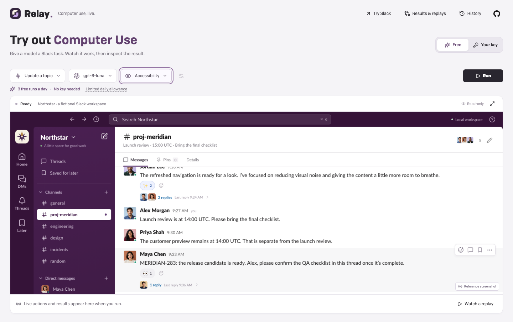
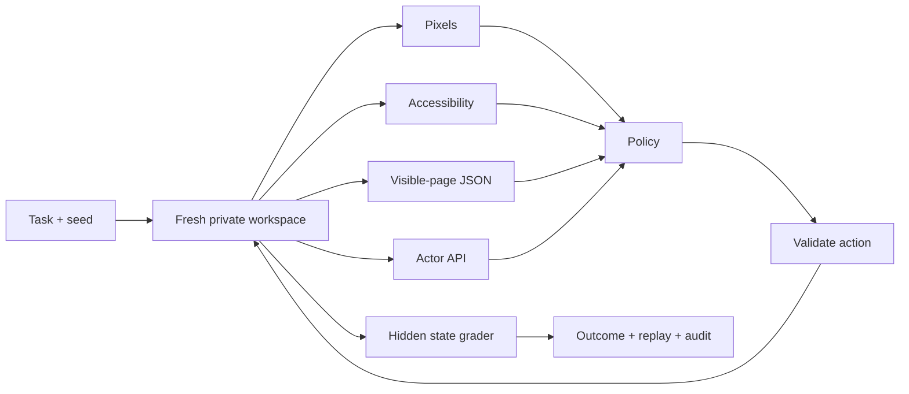

<div align="center">


**A Slack-like playground for computer-use agents.**

Real interactions. Isolated workspaces. Comparable runs. An inspectable audit trail.

[Open Relay ↗](https://relay.kevinliu.studio) · [Get started](#run-locally) · [Jev / System One](docs/system-one.md) · [Evidence](docs/verification.md)


</div>

---

## Try it

- **Run a model:** choose a task, model and interface, then press Run. When the
  free tier is enabled, cheap models need no key. Free runs have a $0.05 estimated
  allowance, with three attempts per network per UTC day and a shared $5/day cap.
- **Use your own key:** connect Ramp Router or TypeSafe to use the compatible
  models available to your account, including model queues and 1v1.
- **Try Slack:** use the mock workspace yourself. No key is required.
- **Results & replays:** inspect all 306 benchmark attempts. **History** groups
  your browser's own runs, comparisons and replay library.

[Free-tier policy and setup](docs/free-tier.md) · [Hosted setup and privacy](docs/hosting.md).

## Onsite submission

- **[Results, full costs and all replays](https://relay.kevinliu.studio/results)**: sortable model table, task filters and per-model drilldowns. Every trial links directly to its trace and recorded UI. No key or new inference required.
- **[Presentation](https://relay.kevinliu.studio/presentation)**: 20 slides from the model-API harness and a concrete editing task through isolation, speed, resource choices, scaling, and two comparisons. [PDF](docs/presentation.pdf) · [speaker and demo notes](docs/presentation-notes.md) · [design decisions explained](docs/design-discussion.md).
- **[Completed matched interface study](https://relay.kevinliu.studio/presentation#interface-results)**: all **96/96** attempts are verified across four models, six tasks and four interfaces. **58 passed, 11 incomplete, 27 blocked.** API passed 21/24, accessibility 18/24, Page JSON 16/24 and pixels 3/24. Nineteen pixel runs were blocked, including 14 connection failures. This describes the fixed harness, not a reliable capability ranking. Estimated allowance: **$22.761576** of $25, including **$2.043534** unresolved. [Plan](docs/campaigns/interface-study-2026-10-05.md) · [Paired results, time and costs](evidence/campaigns/interface-study-2026-10-05/analysis.md) · [All 96 traces and replays](https://relay.kevinliu.studio/demo/review.html?study=interfaces).
- **[Build review](docs/build-review.md)**: task-design mistakes, engineering fixes, and what I would change next time.
- **[One-pass model coverage](evidence/campaigns/model-breadth-2026-10-03-continuation/README.md)**: **306/306 recorded and verified**—152 passed, 61 incomplete, 93 blocked. Seventeen routes × all 18 tasks, one attempt per cell, with no repeats or hidden exclusions.
- **[Requirement-by-requirement assessment](docs/onsite-readiness.md)**: demonstrated behavior, exact failure findings and remaining limits.
- **[Earlier interface study](evidence/campaigns/onsite-2026-10-01/README.md)**: 20 real-model episodes across two models and four interfaces—8 strict passes, 11 incorrect/step-limited outcomes, 1 blocked. Ten planned cells remain unattempted. This is separate from the one-pass comparison.
- **[36-attempt model pilot](evidence/campaigns/model-comparison-2026-10-02-final/README.md)**: 20 passes, 11 incomplete and five blocked/truncated outcomes, with original trajectories preserved.
- **[Review traces and watch replays](https://relay.kevinliu.studio/demo/review.html)**: all 306 attempts have a key-free review page, including failures and blocked runs. Inspect exact requests, responses, action attempts, state changes and outcome checks. Zero-action runs retain their initial workspace without invented playback. [Fidelity and evidence format](docs/trial-review.md).

The earlier interface study recorded about **$0.15 in estimated allowance**;
the separate breadth report records its full shared ledger, including unresolved
reservations. Neither is an invoice. These are development tasks, not a leaderboard.

The 306-cell inventory contains **$189.31101456** in usage-based estimates and
**$3.77939636** in unresolved reservations (35 calls), totaling **$193.09041092**.
The shared ledger, including prior work outside those cells, is **$194.10583757**.
[Per-trial costs, tokens, calls, rates, actions and time (CSV)](docs/results-accounting.csv)
· [Accounting and scope (JSON)](docs/results-accounting.json).
Missing usage is unknown, not free; these are base-rate estimates, not invoices.

## The idea

Give an agent a realistic, multi-step Slack workflow. Watch what it sees, what it tries,
and what actually changed. Then repeat the same task with a different model,
interface, documentation or history policy.

Relay separates **the workspace**, **the policy**, and **the evaluator**. A model
claiming “done” does not make a task pass—the final workspace state does.



<sub>Free-tier interface verification with a fake provider. Live free access requires the configured spending counter.</sub>

**[Try Relay Live →](https://relay.kevinliu.studio)** Bring a **TypeSafe key for Jev**
or a **Ramp Router key**. Choose a model and task, then watch its real browser.
No GPU setup. Keys are kept out of saved history; runs stay in your browser.
Paste a key once: Relay connects automatically, loads published pricing, and
reuses the connection for solo runs and both 1v1 lanes. No pricing form.
[Privacy, budgets and hosting limits →](docs/hosting.md)

**Want to use Slack yourself? [Open the hands-on sandbox →](https://relay.kevinliu.studio/play)**
No key or model required. Send messages, edit, reply in threads, search, use DMs,
pins, saved messages and channel details. Changes stay in that tab and reset on
refresh. This is a personal practice workspace, not a scored agent run.

**No key? [Browse the trial library](https://relay.kevinliu.studio/demo/review.html).** Play a recorded run inside the actual Slack interface,
with the dialog, typed text and action target restored at each step. Try the
model/task selectors to inspect both successes and failures. The main site's
**History → Replays** tab also retains the separately labeled reference examples.
New browser runs include recorded cursor positions and click feedback. **Smart pace**
makes fast actions readable and shortens long waits; **Recorded timing** preserves
capture intervals. Use the expand icon to focus on either the live workspace or replay.

**Expected vs actual** shows the required final values beside the captured values.
Seek through a replay to see which requirements are met at each step. The panel is
for viewers only and does not change the saved grade. [Comparison details](docs/expected-results.md).

**Two models? Open 1v1.** Same task and seed, two fresh workspaces, side-by-side
action feeds and independently checked outcomes. Each model gets its own allowance;
the combined maximum is shown before launch.
Both runs stay in History. [Replay fidelity and match rules →](docs/replay-and-arena.md)

**More models? Choose Try models.** Queue up to eight against the same task and
seed. Each plays live in a fresh workspace, with a separate audit and history.
Default: $2 estimated allowance, 40 actions and 180 seconds **per model**;
Run settings allows up to $5 and 80 actions. Unused allowance is not spent.
The picker shows the total before launch. These exploratory runs are not a leaderboard.


<sub>Playback verification using a labeled fake transport, not live model performance.</sub>

### Small surface. Deep evidence.

| Watch                                   | Compare                               | Inspect                                  |
| --------------------------------------- | ------------------------------------- | ---------------------------------------- |
| Slack-like workspace and agent activity | Matched model/interface/context cells | Inputs, actions, responses and failures  |
| Select an episode and scrub its steps   | Outcome, latency, tokens and cost     | State mutations and deterministic checks |
| Keep controls out of the way            | Preserve errors and unattempted cells | JSON, JSONL and screenshot bundles       |

## Run locally

Requires **Node 24.13+ (24.x)**, npm, and Chromium installed through Playwright.

```sh
git clone https://github.com/Kevin-Liu-01/Relay.git
cd Relay
npm ci
npx playwright install chromium
npm run build:hosted
npm run live
```

Open **[Relay Live → localhost:4340](http://localhost:4340)**. Connect your own key
in the UI. **History**, **Compare**, and **Audit** keep outcomes, exact requests,
actions and screenshots accessible without cluttering the workspace. Download
important runs; browser storage is not a cloud backup.

The published comparison records are separate from private browser history. Open
**[Trial review → localhost:4340/demo/review.html](http://localhost:4340/demo/review.html)**
to inspect them without a key. Original PNG bytes are not included in this compact
structured library; their hashes remain, and original archives are retained.

Connected keys are remembered on this device by default. Uncheck **Remember keys
on this device** for memory-only use; **Forget key** removes that provider's saved
copy. Local storage is unencrypted and readable by scripts on this site—avoid
shared devices. Keys never enter run history or evidence downloads.

For the original local lab and larger experiment matrices, run the application
and operator console in separate terminals:

```sh
npm start
# In another terminal:
npm run lab
```

Open **[Relay Lab → localhost:4330](http://localhost:4330)**.
Choose **Reference script → Update a topic → Compare interfaces → Run** for a
credential-free harness demonstration. Scripts are labeled; they are not model evidence.

To use Ramp Router, copy `.env.example` to a private `.env`, set
`RAMP_ROUTER_API_KEY`, and restart the lab. Discover your available model IDs,
confirm pricing, and start with one small task. Set a provider-side spend cap.
Never commit the key. [Model setup and budgets →](docs/benchmark-lab.md)

### Jev, without a server

Connect **Jev · TypeSafe** and start with **Update a topic → Accessibility**.
Jev selects from a recorded menu of visible actions; the side panel displays its
returned probability distribution. Current Jev is text-only, so its supported
interfaces are accessibility and page JSON—not pixels. Candidate selection and
free-form action generation are different policies, explicitly labeled in comparisons.
[How the adapter works and what is verified →](docs/system-one.md)

## One task, four interfaces



Cross interfaces with supplied `llms.txt` guidance and full versus bounded history.
The API condition changes both visibility and action granularity—it is **not**
equivalent to screenshot-based computer use. [Experiment contract →](docs/lab-plan.md)

## 18 tasks, from controls to coordinated work

| Family                 | Examples                                                           | What gets tested                                                          |
| ---------------------- | ------------------------------------------------------------------ | ------------------------------------------------------------------------- |
| Six original controls  | Thread reply, edit, triage, handoff, delete, topic                 | Exact targets and no collateral changes                                   |
| Release coordination   | Release sync, QA sign-off, publish update, retrospective           | Combine current facts across channels; edit, reply, DM and publish        |
| Operational handoffs   | Incident closeout, on-call briefing, handoff repair, thread repair | Reject stale drafts; preserve message identity and other users' reactions |
| Workspace organization | Saved cleanup, decision record, pin refresh, design handoff        | Later, Pins, Details, descriptions, members and saved thread replies      |

The 12 new workflows require 3–6 coordinated state changes, with meaningful
seed-dependent facts and misleading historical records. The entire final state
is checked—not a model's claim that it finished. Valid alternative action orders
pass. [Full task catalog, grader contracts and low-cost evaluation plan →](docs/task-suite.md)

## Every run has receipts

**Audit trace ↗** opens the complete recorded event trail. Search errors, inspect
model receipts, compare state mutations, and download the full bundle.

New runs record exact prepared requests, UTC timestamps, initial/final state and
hash-bound artifacts. Older captures are explicitly marked **partial** where those
fields were not recorded. Nothing is backfilled as if it were original evidence.
[Audit format, verification and limits →](docs/audit-trace.md)

## Verify it yourself

```sh
npm run verify                  # build, backend and browser checks
npm run test:graders             # 84 positives + 2,583 adversarial state challenges; $0 inference
npm run experiment -- plan docs/lab-reference.json
```

The expanded suite has **169 backend checks and 90 browser checks**. The browser
sweep opens every one of the 306 public trial records without inference. Historical
live model smokes and their failures are retained as JSON evidence; they do not
establish a general leaderboard. Cosmetic seeds are not held-out task families.
The [one-pass campaign](docs/campaigns/model-breadth-2026-10-03-continuation.md) includes real workflow
attempts and preserved failures alongside scripted evidence. No RL training or GPU
experiment is claimed. [Full evidence chronology →](docs/verification.md)

[Model comparison](https://relay.kevinliu.studio/presentation#model-comparison) has sortable model results
and a custom per-task filter. The completed inventory has **one attempt for every
task/model**: 18 tasks × 17 routes = **306 cells**, no repeats. Family/tier coverage
includes OpenAI, Anthropic, xAI, Qwen, DeepSeek, GLM, Kimi, MiniMax and NVIDIA;
this is not a measured popularity ranking. Gemini needs a separate Google key;
Llama/Mistral are absent from the account catalog.

The earlier repeated-trial study stopped at 37 attempts. The first breadth worker
added 68 unique attempts before a known-cost cell spend limit stopped its scheduler.
The separately recorded continuation preserved all 105 and collected only the 201
untouched cells. Its scheduler could advance after a verified, fully accounted
per-cell spend stop; it never retries that cell or raises its limits. CSV origin
fields distinguish the cohorts.
Same actor source, fixtures, observations and grader; one task seed, not a holdout
or repeatability estimate. The original $300 shared ceiling still includes every
prior campaign and probe. [Plan and limits](docs/campaigns/model-breadth-2026-10-03-continuation.md)
· [Current collection status →](evidence/campaigns/model-breadth-2026-10-03-continuation/README.md)

Final shared recorded allowance is **$194.10583757**, including retained
reservations and earlier campaigns—not an invoice. All 306 attempts were
independently reopened from 277 original archives: **26,403 integrity checks and
2,007 saved-state grading checks agreed**, with zero capture gaps. The
[completion certificate](evidence/campaigns/model-breadth-2026-10-03-continuation/verification.json)
binds the exact final summary and recorded source/build receipts.

The `release-sync` instruction has an ambiguous source location; `design-handoff`
leaves substitution of its quoted DESIGN placeholder implicit. Both 17-cell slices
are retained with these [task-quality caveats](docs/campaigns/model-breadth-2026-10-03-observations.md),
not presented as clean evidence of model capability. No task wording, grade or
trial was changed after observing results.

The separately preserved [36-attempt pilot](evidence/campaigns/model-comparison-2026-10-02-final/README.md)
has 20 passes, 11 incomplete, four output limits and one connection failure.
Different model set/action allowance: its results are not pooled with the new matrix.
Earlier [six-model](evidence/campaigns/model-comparison-2026-10-02/README.md) and
[strict follow-up](evidence/campaigns/model-comparison-2026-10-02-followup/README.md)
campaigns stay separate and immutable, including their failures.

Hosted text policies now survive optional screenshot failures, but cloud PNG
capture still has intermittent gaps. Live viewing and actual-UI replay remain
available; missing images are disclosed in the audit. Hosted pixel-policy
reliability has not been established. [Current capture limits →](docs/hosting.md#capture-failures)

## Under the hood

- **React + Vite** for the workspace and console.
- **Session-private SQLite** for deterministic fixture state and audit events.
- **Playwright** for isolated browser contexts and permission-limited actions.
- **Ramp Responses** for bounded model calls, with no hidden retries or fallback models.
- **TypeSafe Jev** for bounded Choice decisions with exact candidate/probability receipts.
- **Vercel + Chromium** for short-lived BYOK runs and a continuous spectator feed.
- **Lucide + theSVG** for UI glyphs and provider/technology marks; self-hosted Camber for Relay's interface, OFL Lato for Slack. See [font rights](THIRD_PARTY_NOTICES.md#camber--relay-interface).

Public assets exclude the proprietary icon font and stock portraits used in the
private reference prototype. Brand marks identify integrations, not endorsement.
[Third-party notices →](THIRD_PARTY_NOTICES.md)

## Explore

[Architecture & isolation](docs/architecture.md) · [Research landscape](docs/research.md) ·
[Trainer interface](docs/trainer.md) · [Verification](docs/verification.md) ·
[Hosting & privacy](docs/hosting.md) · [System One](docs/system-one.md) ·
[Handoff](docs/handoff.md) · [Presentation](docs/presentation.html)

---

<div align="center">

Built by **[Kevin Liu](https://github.com/Kevin-Liu-01)**.<br />
A focused environment for studying agents—not an official Slack product.

</div>

Original code and documentation: [MIT](LICENSE). Dependencies, fonts and brand
assets retain their [own licenses and restrictions](THIRD_PARTY_NOTICES.md).
