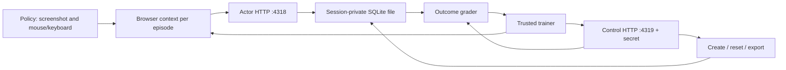

# Architecture, isolation and scaling

## Comparison workbench

Relay Lab adds a loopback operator console on 4330 and a trusted worker in `runner/`.
It supports four observation/action gateways and calls Ramp Router server-side.
The policy never receives operator/control credentials. Interface, documentation
and history conditions are recorded separately. See [the lab contract](benchmark-lab.md).
State ownership, the original grader and hostile-code limitations below remain unchanged.

Relay Live adds a public BYOK surface with request-owned browser/app instances,
live spectator frames and browser-local history. It uses the same experiment core,
plus a TypeSafe Jev candidate-selection adapter. See [hosting](hosting.md) and
[System One](system-one.md) for the distinct data flow, bounds and limitations.

## Design decision

Build an original, narrowly scoped React workspace and a small deterministic state engine rather than adapting a production collaboration stack. The goal is credible computer interaction plus trustworthy evaluation—not reproducing every Slack endpoint. Static mockups are insufficient because an agent must change persistent state; a full enterprise clone adds authentication, hosted-backend and reset costs unrelated to the selected tasks.

The app and control listeners currently share one Node process. This separates interfaces and secrets, **not process privileges**. The browser app cannot fetch grader routes from its own origin. CSP, host/origin checks and the trainer's browser-request allowlist reduce accidental cross-boundary access. They do not replace a separate OS/network sandbox for an agent allowed to execute arbitrary code.

## State and session ownership

- A random 256-bit capability identifies one session; filenames use its SHA-256 digest. Tokens are validated before constructing paths.
- One SQLite file contains that session's metadata, current workspace JSON, revision counter, mutation/UI events and idempotency receipts. Files have independent lifecycles; no table needs a tenant filter to separate sessions.
- Actor identity is fixed to Alex Morgan. The server, not a browser-supplied author, enforces message ownership and conversation membership.
- No cookie or localStorage session is shared between tabs. Browser workers should still create one fresh BrowserContext per episode to isolate cache, local state and focus history.
- Session directories default to owner-only access; operator keys are owner-readable. Tokens are never intended as user authentication for a public SaaS service.
- A 24-hour TTL and a 256-session cap bound the default pool. Expired files are swept on creation. Explicit close is preferred. There is no background janitor or guaranteed immediate TTL file removal.

## Writes, resets and reproducibility

An actor action carries an expected revision and request ID. The server validates and applies the transition inside one SQLite transaction, stores the new state and event, and records the idempotency receipt. A stale revision receives 409; retrying the same request ID/action is acknowledged once, while reusing it for a different action fails.

Reset restores the fixture at the session's original seed but increments the revision, fencing stale requests. It retains audit events and clears idempotency receipts. UI state is reset by opening a fresh context; resetting only the database does not close panels in an existing page. `RelayEnvironment.reset()` creates a new session/context and retires the old episode—export first if it matters.

Message timestamps derive from the fixture clock plus revision, not wall time. Audit timestamps record actual interaction time. Repeating a fresh seed and action sequence yields the same workspace state; reset-in-place revisions deliberately differ. The code is deterministic, not a claim of deterministic model behavior or pixel-identical rendering across operating systems.

SQLite provides atomic transaction recovery, and tests verify committed state survives a fresh OS process. We have **not** simulated disk loss, killed writes at every SQLite I/O boundary, or validated power-loss durability. Store data on persistent local storage, not an ephemeral worker directory, when recovery matters.

## Reward contract

The original six tasks keep their v1 contracts. New multi-step tasks use the
separately versioned fixture and independent declarative grader in
`server/workflow-seed.mjs` and `server/workflow-tasks.mjs`. The public shared
catalog contains labels/capabilities only, not answers. See the
[task suite](task-suite.md) for outcome contracts and adversarial checks.

The evaluator constructs the expected state from the same deterministic fixture and compares the complete final workspace, with narrowly permitted generated-message metadata. It checks author, destination, parent, exact text, uniqueness and absence of unintended final changes. A replacement post does not satisfy editing; a right answer in the wrong channel does not satisfy messaging; pinning the wrong incident does not satisfy triage.

Reward is binary and sparse. `step()` returns zero before finish/budget exhaustion; terminal reward is one only if all checks pass. Diagnostic check names are retained in operator exports, not policy observations. There is no LLM judge, so text tasks explicitly request exact strings. A paraphrase can be semantically acceptable but intentionally fail this contract.

Final-state equivalence is the present policy: a reversible unintended action that is fully undone can still pass. Audits record it, but do not currently impose path-level safety penalties. For safety-sensitive tasks, add explicit forbidden-event checks instead of silently changing the success criterion. The grader is inspectable source, so meaningful held-out evaluation requires withholding it and task metadata from the actor's execution environment.

## Scaling choices and honest limits

| Component        | Current implementation                                                                                | Scale-up path / cost                                                     |
| ---------------- | ----------------------------------------------------------------------------------------------------- | ------------------------------------------------------------------------ |
| Frontend assets  | Shared build plus locally hosted fonts/photos; initial ~273 KB measurement predates the visual update | Cache immutable assets; same bytes across sessions                       |
| Session data     | ~48 KiB per measured post-mutation fixture                                                            | File-per-session cloning/pooling; larger fixtures need indexed rows      |
| Writes           | Synchronous SQLite, one short transaction                                                             | Partition sessions across Node workers; avoid shared writable files      |
| Reset            | Replace deterministic JSON in one transaction                                                         | Prebuilt snapshots for large fixtures; never globally reset a shared DB  |
| Browser          | One context per episode                                                                               | Pool browser processes with bounded contexts; recycle leaking workers    |
| Hostile policies | Not supported as a security boundary                                                                  | Isolated container/VM, egress deny rules, hidden control service/secrets |
| Coordination     | One process, local metadata                                                                           | Router maps session → owner shard; TTL lease, quotas and janitor         |
| Evidence         | Session audit + runner transitions + screenshots                                                      | Asynchronous object storage; sample screenshots, keep terminal checks    |

API throughput is not agent throughput. Browser rendering, screenshots and model inference are likely to dominate this small fixture. The measured screenshot p50 is ~69 ms versus ~1.4 ms mutation round-trip. This suggests optimizing observation cost first, but a sustained multi-browser test is needed before allocating pool size.

The benchmark runs 100 stored sessions, 400 reads at concurrency 16, and 10 sequential browser contexts. It does not establish 100 simultaneous browsers, p99 reliability, cross-host isolation or hours-long memory stability. Memory numbers include the benchmark client/Playwright library in the Node process and exclude Chromium children. Do not extrapolate a production sessions/GB figure from them.

## Threat model and deployment checklist

Assume an evaluated policy can see rendered content and issue allowed browser actions. Do not assume it is trusted with the machine. Capability URLs can leak through histories, browser trace archives, process logs or copied links; referrers are disabled and public evidence is token-free. Raw trace/video folders remain ignored.

The public deployment is a bounded BYOK demonstration, not a general hostile-policy
service. It adds TLS, request-owned directories/contexts, same-origin checks and
per-run limits. Before broader multi-tenant use: real user authentication, global
admission/rate limits, actor/control process split, network ACLs, OS sandboxing,
crash cleanup and sustained browser soak tests. A provider key is not Relay user
authentication. See [the exact hosted boundary](hosting.md).
