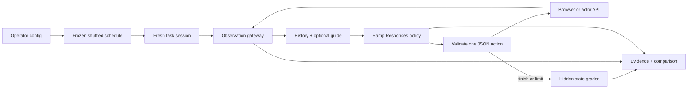

# Relay Lab: interface and context experiments

Relay now includes a runnable comparison harness at **http://localhost:4330**.
Launch reference scripts or Ramp Router policies, inspect actions/observations,
replay episodes, and export evidence. The default view is a minimal workspace
monitor: Slack in the center, actions on the right, and replay beneath it. Settings,
raw observations and comparison tables are available on demand. Authenticated
smokes are recorded separately from scripted and fake-provider tests; see
[verification](verification.md).

## Run and demonstrate

```sh
cd Relay
npm ci
npx playwright install chromium
npm run build
npm start
# In a second terminal:
npm run lab
```

App: 4318; hidden trainer/control: 4319; operator console: 4330. In the console,
select **Reference script**, **Update a topic**, **Compare interfaces**, then **Run**.
This runs channel-topic through accessibility, page JSON and API. Each changes a
real fresh workspace and is checked by the existing grader. These are builder-informed
scripts—not LLM evaluations or screenshot-policy evidence. With a key configured,
the default is one GPT-4o mini accessibility episode, discovered from the key's
catalog, with a local $0.50 estimated ceiling. Nothing starts automatically.

The screen follows the active episode. Click an action or drag the replay slider
to inspect its pre-action screen; **Latest / Follow live** resumes following.
Episode tabs switch conditions. **Agent input** shows the actual observation;
**Details** shows the selected action/receipt/checks; **Results** holds comparisons.
The monitor is read-only: human clicks cannot intervene in an evaluated workspace.
Console API runs use a separate operator-only browser view of the **same session**.
It follows the last API conversation and refreshes at capture boundaries. Those
images never enter API policy inputs. Headless CLI API runs still use no browser.
Grader checks are operator-only and never fed back into an ongoing policy.
Local replay links can select a saved run and episode with
`/?run=RUN_UUID&episode=episode-001`. Opening a link never starts a model call.
**Audit trace ↗** opens all recorded events, state exports and integrity checks.
Append `&view=audit` for a direct link. JSON, JSONL and full screenshot-inclusive
bundles are downloadable. [Capture details and historical gaps](audit-trace.md).

## Connect Ramp Router

1. Create a key using [Ramp's setup guide](https://docs.router.com/getting-started/quickstart).
   Set a **provider-side lifetime spend cap**, initially $1 for a bounded smoke.
2. Copy `.env.example` to a private `.env`; set `RAMP_ROUTER_API_KEY`. Never put
   secrets in chat, run configs, browser inputs or `VITE_` variables.
3. Restart `npm run lab`. Existing shell environment values take precedence.
4. Use the model dropdown for low-cost options, or **Settings** for the full
   account-visible catalog and multi-model comparisons. Confirm positive rates
   and image-input support for pixels. Unknown/zero pricing fails closed.
5. Start with one model, one task and one interface. Review that trace before
   expanding. Maximum local matrix: eight models, 240 cells, one active run.

Transport: `GET https://api.router.com/v1/models`, then
`POST https://api.router.com/v1/responses` with the Router Bearer key. Responses
inputs/outputs, requested/returned model and request/trace receipts are recorded.
No Chat Completions, OpenRouter substitution, Ramp CLI installation, fallback
model list or hidden retry. Adaptive Flex is explicitly disabled; account routing
and aliases can still change. Check Router logs for actual provider/billing details.
[Connection guide](https://docs.router.com/getting-started/connect),
[request fields](https://docs.router.com/api/request-fields).

The UI has dated **price hints**, not callable IDs, for seven low-cost candidates:
GPT-4o mini, GPT-6 Luna, GPT-5 nano, DeepSeek V4 Flash, GLM-5.3 Flash, Nemotron
Lightning 3.5 30B and MiniMax M3. They are not tested recommendations. Match exact
IDs from your key's catalog and verify current capabilities/rates; base rates do
not cover every tier, context or caching adjustment.
[Router supported models, checked 2026-09-29](https://docs.router.com/supported-models).

## Frozen comparison design

| Factor           | Implemented choices                                 | Interpretation                                        |
| ---------------- | --------------------------------------------------- | ----------------------------------------------------- |
| Interface        | `pixels`, `a11y`, `json-ui`, `api`                  | Joint observation/action conditions; see below.       |
| Site guide       | Absent / supplied llms.txt + linked guide           | Injection, not automatic discovery.                   |
| History          | `full` / `recent-4`                                 | All or four preceding observation/action/error turns. |
| Model            | Exact Router catalog ID; optional reasoning setting | Fixed requested route, not immutable model weights.   |
| Task/seed/repeat | 18 tasks, configurable seeds/repetitions            | Matched blocks, not held-out reasoning templates.     |

Task instructions, actor, permissions and grader remain fixed. Each model ×
interface × guide × history cell gets a fresh session and conversation. The
complete schedule is persisted first; a seeded shuffle randomizes block order
and cell order within each task/seed/repetition block.

The original six control tasks retain their frozen v1 fixtures and graders.
Twelve [multi-step workflows](task-suite.md) add cross-channel retrieval, current
versus superseded facts, preservation constraints and 3–6 coordinated mutations.
Their v2 seeds vary substantive facts, but are still public development templates,
not held-out families. A short topic task cannot reveal long-history effects;
even the longer tasks need trace review and actual matched model runs before
interpreting context results. Reference scripts intentionally ignore the
guide/history intervention; only real model policies can show whether it helps.

### Visibility/action contracts

| Interface     | Observation                                          | Actions                                     | Caveat                                                                 |
| ------------- | ---------------------------------------------------- | ------------------------------------------- | ---------------------------------------------------------------------- |
| Pixels        | Current 1440×900 PNG, low-detail provider input      | Coordinate click/hover/scroll, typing, keys | No DOM/API. Provider image preprocessing is part of the condition.     |
| Accessibility | Rendered-document accessibility tree + viewport refs | Ref click/hover/fill, keys, scroll          | Tree can include offscreen content; not information-matched to pixels. |
| Page JSON     | Viewport-intersecting text and controls              | Same ref actions                            | Clips scroll containers/hidden styles; not occlusion-perfect.          |
| API           | Conversations/users, then messages/search on demand  | Actor-authorized domain mutations           | Broader retrieval/coarser actions; not a CUA score.                    |

API aliases are minted on disclosure. Semantic fixture IDs never appear in policy
observations. Writes use the actor listener—not Store or grader access. There is
no policy reset/evaluate/shell/JavaScript/filesystem/arbitrary-HTTP action. Browser
egress is limited to the app origin; clipboard, developer-tool and navigation
shortcuts are blocked. These gateways are not an OS sandbox for hostile code.

The app actually serves `/llms.txt` and `/agent-guide.md`. They contain interaction
guidance, not task answers. Guide-enabled cells receive their exact hash-recorded
contents. llms.txt is a Markdown guidance proposal, not an executable API or a
guarantee of automatic discovery. [Specification](https://llmstxt.org/).

## Execution loop



One JSON action per response avoids provider-specific tool-calling dependencies.
Invalid JSON/rejected actions consume attempts and receive explicit next-turn
error feedback. There is no unrecorded repair call. Failed/incomplete provider
responses and invalid usage receipts never execute actions. Final grader results
are never sent back into the model conversation.

The unchanged binary grader checks the exact intended mutation, ownership,
destination, uniqueness and absence of unwanted **final-state** changes. It is
not an LLM judge. Reversible collateral actions that are undone can still pass;
the audit records them. Path-level safety constraints require a new explicit
contract, not a silent grader change.

## Metrics and limits

- All started cells remain, including errors, cancellation and truncation.
  Unstarted cells are unattempted, not failures.
- Capture outcome, attempts, episode wall time, inference latency, reported
  input/output/cache/reasoning usage and estimated USD. Mean wall time includes
  setup, observations, operator captures, grading and cleanup—not just inference.
- Reserve estimated cost before requests using text bytes, 8,192 units per image,
  and maximum output tokens. This is conservative accounting, not an exact
  tokenizer or proven upper bound for every image/tokenization scheme.
- Reconcile valid reported usage at configured base rates. Missing usage/network
  failure/interruption retains the reservation and marks usage **unknown**.
  Estimates are not invoices or hard billing caps; use Router key spend limits.
- Bound actions, requests, input units, output tokens, episode/run time and
  estimated dollars. No automatic retry. Cancellation aborts inference and blocks
  later actions. Finite local operations/cleanup may extend beyond the action
  deadline; each control request is bounded to ten seconds.
- On restart, interrupted runs remain interrupted; usage and denominators are
  repaired conservatively. Never automatically rerun an unknown in-flight call.
  Orphaned sessions may persist until app TTL sweep; cleanup errors remain visible.

Tables and paired B−A contrasts are descriptive. Pairs match model, task, seed,
repeat and all other factors. Incomplete pairs are excluded from contrasts but
remain in the attempt ledger. There are no invented confidence intervals or
p-values. Repeated seeds share task templates and do not establish broad rankings.

## CLI and evidence

```sh
npm run experiment -- models
npm run experiment -- plan docs/lab-reference.json
npm run experiment -- run docs/lab-reference.json
npm run experiment -- export RUN_ID artifacts/my-comparison
```

`docs/lab-ramp-template.json` intentionally refuses to run until its placeholder
ID and zero rates are replaced with verified values. Add models to `models` for
a sweep; add seeds and tasks without altering the runner.

Each `.runtime/lab-runs/<uuid>/` contains `run.json` and one folder per episode:
`steps.jsonl` (append-only hash-linked request/response/action records),
`episode.json`, `outcome.json` (state/audit), pixel input PNGs, operator-only
`visual-NNN.png` captures for text-UI modes, and final browser screenshots.
The original Results export is a JSON bundle; screenshots are separate. The new
Audit full bundle includes PNGs plus JSON/JSONL. The CLI export copies
a credential-scanned portable directory with all artifacts, refusing overwrite.

Source/lockfile hash, config, guide and catalog receipts accompany each run.
Per-episode app health receipts independently identify the backend loaded by the
server and the actual built assets. A stale build can differ from current source;
rebuild/restart before comparisons and do not edit/rebuild during runs. Local hash
chains detect accidental alteration, not an operator able to rewrite all evidence.
Hosted aliases are not immutable checkpoints.

The console is loopback-only, validates Host/Origin, and requires a page-local
CSRF token for start/cancel. Provider/control keys remain server-side. Never give
the operator console to an evaluated policy. Docker still hosts the app only;
browser/lab workers run separately. Keep `.runtime` and raw browser traces private.
Console runs record `operatorVisuals: true`; observer setup/reloads/screenshots
add wall-time overhead, including in API mode. Do not compare that wall time with
unmonitored CLI runs as though capture costs were identical.

The single-active-run guard is per console process. CLI runs have their own budgets
and are not cancellable from the console; use Ctrl+C in their terminal. Console
restart recovery never overwrites CLI/library checkpoints. Unfinished CLI runs
are retained untouched, including unknown in-flight spend; they are not resumed.
Completed CLI runs are imported into the console's run history automatically.

## Positioning and next gates

GUI/API benchmarking is not new. [Beyond Browsing](https://arxiv.org/abs/2410.16464)
compares browser/API/hybrid agents; [MCPWorld](https://arxiv.org/abs/2506.07672)
combines these interfaces with white-box verification. [BrowserGym](https://github.com/ServiceNow/BrowserGym)
and [AgentLab](https://github.com/ServiceNow/AgentLab) provide established harnesses.
Relay contributes an inspectable Slack experiment implementation, not an established
novel research result.

Next, in order:

1. Configure Router, run 3–5 real-model smokes, inspect failures, then expand the
   paired matrix. No model winner until real receipts exist.
2. Add held-out task families varying facts, compositions, distractors and permissions.
3. Match information scope: viewport accessibility and matched-retrieval API controls.
4. Separate guide discovery from injection; charge document retrieval steps/tokens.
5. Add injection-bearing content, stale revisions, transient failures, destructive
   actions and path-level safety checks with explicit positive/negative graders.
6. Measure browser-pool concurrency and full-process memory in sustained soaks;
   add a BrowserGym adapter before building another broad benchmark ecosystem.
7. Test native browser tools only after capability detection. A JSON endpoint is
   not automatically WebMCP; its [current draft](https://webmachinelearning.github.io/webmcp/)
   describes `document.modelContext` and is not a finalized standard.

No RL optimizer, policy training, adaptive router or H100 workload is included.
The delivered environment, reward/trajectory bridge and bounded model loop are
the foundation for those later experiments.
