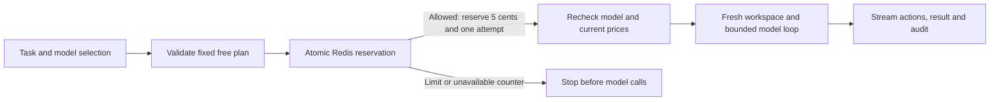

# Free runs and BYOK

Relay has two separate payment paths. Switching paths never launches inference.

| Path     | Models                                              | Who supplies the key       | Limits                                                                                               |
| -------- | --------------------------------------------------- | -------------------------- | ---------------------------------------------------------------------------------------------------- |
| Free     | Reviewed cheap Router routes                        | Operator, server-side only | $0.05 estimated allowance per run; $5 total per UTC day; 3 admitted attempts per network per UTC day |
| Your key | Compatible routes in the visitor's provider catalog | Visitor                    | Existing hosted limits; no access to the operator key                                                |

Anonymous visitors cannot be identified reliably as individual people. The daily
visitor limit uses the network address, so people on shared Wi-Fi share three
attempts. IPv6 privacy addresses in one /64 share a counter. VPN changes can
bypass a network limit, but cannot raise the shared $5 daily allowance. There is
no claim of account-grade identity or bot prevention.

## What the server allows

- Four exact routes: GPT-6 Luna, DeepSeek V4 Flash, GLM 5.3 Flash and GPT-4o mini.
- A route is admitted only while fresh catalog prices are positive and no higher
  than $0.15 input / $0.60 output per million tokens. No guessed prices.
- One selected task and one text interface: accessibility, page JSON or actor API.
- One fixed seed, no guide, recent-four-action history, 20 actions/calls and 2,048
  output tokens per request. The existing 180-second episode deadline remains.
- The client supplies only `access`, `model`, `task` and `interface`. Extra fields,
  keys, arbitrary prompts, endpoints, price overrides and matrices are rejected.
- Pixel runs, queues, matched-interface comparisons and 1v1 use BYOK.
- Both paths use the same workspace, outcome grader, stream and evidence format.
  Free attempts are not added to the frozen 306-trial comparison.

## Durable admission

`hosted/free-tier.mjs` owns the policy. A single Redis Lua operation checks and
increments the global integer-cent counter and daily visitor counter. All
instances and deployments use the same keys. Redeployment does not reset limits.
The full five cents remains reserved for that UTC day, including failures,
disconnects and unknown usage. The implementation deliberately makes no refunds;
at most 100 free attempts can be admitted per day. Failed starts count even when
no inference occurred. A new UTC day gets new counters; old entries expire after
48 hours. Do not delete live counters or enable Redis eviction.

These are conservative **base-rate estimates, not invoice guarantees**. Provider
charges, discounts and changes outside the resolved catalog are not controlled
by Relay. Use a separate, provider-capped Router key for the public demo. Vercel
compute and Redis costs are separate from the model allowance.

The Vercel deployment uses the edge-provided `x-vercel-forwarded-for` address;
local mode ignores forwarded headers and uses the socket address. Raw addresses
are never sent to Redis. A server-only HMAC secret and UTC date create the daily
identifier. Missing identity, broken Redis, bad responses, uncertain writes or
missing secrets fail closed. No automatic retry occurs. There is no in-memory
fallback. Same-origin checks complement admission; they are not authentication.

See [Vercel's request-header contract](https://vercel.com/docs/headers/request-headers)
and [Upstash's atomic Lua REST interface](https://upstash.com/docs/redis/features/restapi).

## Deployment setup

Store these as **production server environment variables**, never `VITE_*`:

| Variable                               | Purpose                                         |
| -------------------------------------- | ----------------------------------------------- |
| `RELAY_FREE_ENABLED=1`                 | Explicit opt-in; omit or set `0` to disable     |
| `RELAY_FREE_RAMP_KEY`                  | Operator's dedicated Router credential          |
| `RELAY_FREE_VISITOR_SECRET`            | Random secret of at least 32 characters         |
| `KV_REST_API_URL`, `KV_REST_API_TOKEN` | Dedicated non-evicting Upstash Redis REST store |

The equivalent `UPSTASH_REDIS_REST_URL` / `UPSTASH_REDIS_REST_TOKEN` pair is also
accepted. Keep the visitor secret stable through each UTC day. Never reset the
store during a rollout. Use the same store across aliases and deployments that
share this allowance; do not enable free access on previews with a separate store
and the same owner credential. Set eviction and automatic paid-plan upgrades off.

After deployment, verify `GET /api/relay?op=config` reports the intended public
limits. It must not contain credentials. Check model discovery, one bounded
smoke run, its final audit, and the quota denial path. Do not enable the feature
until the durable store is configured and its atomic behavior is verified.
Deleting the enabled flag and redeploying disables new free admission without
affecting BYOK, public results, replays or the manual Slack sandbox.

## Verification

- `tests/free-tier.test.mjs`: fixed plan, price ceiling, key separation, unknown
  fields, trusted address handling, hashed identity, Redis command and fail-closed
  behavior. Mock transport tests do not prove a real Redis service is available.
- `tests/browser/free-tier.spec.mjs`: keyless model discovery, single-click launch,
  duplicate-click suppression, full hosted fake-provider audit, free/BYOK switching,
  budget exhaustion, refresh, responsive layout and history/comparison navigation.
- Existing hosted isolation, replay, pricing and run-handoff tests remain required.
- `node scripts/check-free-quota.mjs` checks the actual Redis Lua operation with
  129 competing requests in a unique three-minute test namespace. It expects
  exactly 100 admissions, including no more than three for one visitor. Load
  Redis credentials privately; no Router credential or inference is needed.
  This check uses billable Redis operations and must use an authorized store.

All regression tests use fake inference. Report actual deployment and live-smoke
verification separately in `docs/verification.md`.
