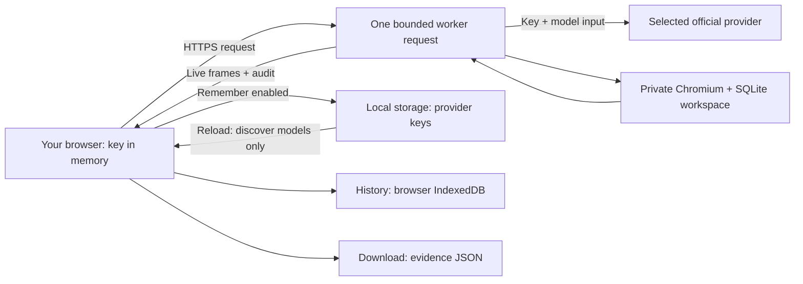

# Relay Live · hosted BYOK

Open **[relay.kevinliu.studio](https://relay.kevinliu.studio)**. Choose **Connect a key**, select **Jev · TypeSafe** or **Ramp Router**, and enter that provider's key. Model discovery uses your account, not a fabricated model list. Select a task, model and interface, then **Run**. A TypeSafe key is sufficient for Jev; no SGLang server, GPU or H100 allocation is required.

The large screen is the agent's actual browser, streamed while it works. It is read-only for the observer. The right panel shows Jev's returned action probabilities or a generative model's recorded actions. Replay, Audit, History and Compare stay out of the workspace until needed.

**1v1** runs two matched, request-isolated systems side by side. **Replays** offers
no-key examples and your saved runs, played through the actual read-only Slack UI.
The current action and independent outcome checks have dedicated cards. See the
[match and replay contract](replay-and-arena.md), including legacy capture limits.

## Run the same interface locally

```sh
npm ci
npx playwright install chromium
npm run build:hosted
npm run live
```

Open `http://localhost:4340`. This path accepts keys in the UI; it does not load a shared provider key from `.env`. The original local operator lab on port 4330 remains available for larger matrices, CLI runs and raw audit archives. The cloud limits below do not apply to that separately configured local runner.

## Where data goes



- The key is sent to Relay's worker and only the selected provider's fixed official API. It is not a browser-to-provider direct connection. Keys and authentication headers never intentionally enter server persistence, run history, audit, replay or downloads. JavaScript memory is not guaranteed to be securely zeroized.
- **Remember keys on this device** is enabled by default, per the operator's requested behavior. After a successful connection, the latest key per provider is saved in the `relay-credentials-v1` localStorage record, separate from IndexedDB evidence. Solo and 1v1 connections share it. Reload restores the last connected provider and discovers its account models; it never resumes a run or starts inference. Editing or unsuccessfully connecting a replacement does not overwrite the saved key.
- Local storage is **not encrypted** and scripts running on this origin can read it. Anyone with access to this browser profile may use it. Avoid shared devices. Unchecking Remember immediately clears all saved provider keys while leaving current in-memory connections usable. With remembering enabled, one key per provider is retained; if both arena lanes use different keys for the same provider, the most recently connected one is remembered.
- **Forget key** clears that provider's saved copy and the current UI connection, including matching arena lanes. It does not erase run history, revoke the provider credential or clear copies already held in another tab's memory. Clearing this site's browser data removes keys and history. Provider-side revoke/rotation remains your responsibility. A key previously pasted into a conversation should be rotated before continued use.
- Corrupt stored credentials are ignored. Blocked storage falls back to in-memory use with a visible warning on save/removal failure. A saved key that fails authentication remains available to update or forget; there is no retry loop or provider substitution.
- History belongs to this browser profile and origin. Other visitors cannot query a shared history endpoint. Clearing browser storage deletes history; another device will not see it. Download important runs.
- Each run owns a random temporary directory, loopback application/control listeners, control secret, SQLite sessions and fresh browser contexts. Normal completion/disconnect closes them and deletes temporary run files. Forced process termination can prevent cleanup; temporary files are not durable storage or a recovery guarantee.
- The observer receives initial/final state and grader results as audit evidence. The model receives only its configured observation interface, not the observer's final audit or control secret.

## Bounds and costs

| Resource                      |             Hosted maximum |
| ----------------------------- | -------------------------: |
| Episodes / run                |                          3 |
| Actions / episode             |                         40 |
| Model calls / run             |                         80 |
| Model-loop time / run         |                150 seconds |
| Episode time                  |                 90 seconds |
| Estimated model spend / run   |                      $0.50 |
| Input allowance / request     | 128,000 conservative units |
| Generated output / request    |               4,096 tokens |
| Concurrent runs / warm worker |                          2 |

The UI starts below these limits. Estimates use the recorded rates, not invoices. Missing usage stays unknown and stops further calls. Set provider-side spend caps. Stopping or losing the connection can leave one already-sent request billable; there are no hidden retries or model substitutions.

The output allowance includes internal reasoning, not only visible action JSON.
Hosted defaults now allow 4,096 tokens instead of 512; per-run dollar and time
caps are unchanged. This is room to finish a response, not a target token spend.
Reasoning effort remains the provider default unless explicitly configured; it
is not silently disabled. Incomplete responses never execute partial actions.
Audits retain allowlisted incomplete reasons and validated usage when supplied;
rejected receipts still conservatively retain the reservation in run accounting.

The 12 [multi-step workflows](task-suite.md) default to 40 actions / 90 seconds;
the six original controls default to 12 actions / 60 seconds. Dollar caps are
unchanged. Longer workflows may hit the hosted time limit; the separately
budgeted local runner supports longer episodes. More permitted actions are not
a promise that any model will finish within the cap.

Pricing now loads automatically; there is no confirmation form. The worker joins
account-discovered model IDs to official published pricing, rechecks it before
execution and records source/date/hash with the catalog. Unknown or expired rates
disable that model instead of guessing. Public documentation requests carry no
credentials. Saved connections work across solo and 1v1; key entry is debounced
and run launches are single-flight. See the [interaction contract](interface-controls.md)
for cache, fallback and cancellation details.

**These are not global abuse controls.** Autoscaled workers each have their own concurrency counter. A valid provider key is required before browser allocation, but is not Relay user authentication. The operator still pays hosting compute/egress. Before promoting this beyond a bounded demo, configure hosting spend alerts/limits, global rate limiting or authenticated access, and measure sustained browser load. Those controls are not claimed by this release. The function time limit is 240 seconds; graceful cleanup is attempted before it.

## Deployment and operations

### If Router rejects a run

Router [documents HTTP 403](https://docs.router.com/api/errors-and-limits) as
provider unavailability, not a failed Slack action. Relay shows **Provider
unavailable**, preserves the request ID, and offers **Choose another model**.
Selecting a model does not start a paid request; press Run when ready. A model's
presence in the account catalog does not guarantee it can serve every request.
For persistent 403s, check the selected provider's availability/access in Router
or contact Router support with the request ID. Relay cannot change provider or
account access, and never circumvents a rejection or silently substitutes a model.

401 points to a key requiring attention, 402 to Router credit, 404 to model
availability, 429 to a rate limit and 501 to an unsupported capability. The UI
keeps provider blockage separate from completed-but-wrong task outcomes. A
zero-action error's workspace checks are diagnostic only. Missing usage is
**unknown**, and retained budget allowances are not billed charges. Router's logs
are needed to resolve actual billing; no raw error body is persisted.

### Release process

The Vercel project is `relay` in `kl01s-projects`, connected to `Kevin-Liu-01/Relay` on `main`. `vercel.json` builds `build:hosted` and packages a Node 24 function with Chromium. The build preserves `workspace.html` for the private app and makes the public `index.html` the live console; an index-file rewrite alone is insufficient on this deployment.

No shared model secret is deployed. `.env*` (except the example), `.runtime`, `.vercel`, private traces and local reports are excluded from the public repository/archive. Content Security Policy restricts the UI to bundled, same-origin assets and requests. There is no arbitrary upstream URL field or generic proxy.

Before release: `npm run verify`, `npm run test:report`, `npm run evidence`, `npm run package`. After deployment, check the home page in a browser, public config, TLS and a bounded live run. A 200 response alone did not catch the initial wrong-entry-page bug.

The optional `scripts/hosted-smoke.mjs` uses a private `RAMP_ROUTER_API_KEY` environment variable and accepts only the verified Relay production hosts. Its arguments are host, interface, exact model ID and optional task ID (default `channel-topic`). It checks the authenticated account catalog and published server pricing before launch. Each invocation caps eight calls and $0.10 estimated spend. It saves failures as well as successes under ignored `.runtime/hosted-smokes`; it is not a benchmark campaign. A missing final audit, no live frames, failed task or capture warning produces a nonzero exit. It never retries inference or substitutes a model.

### Capture failures

Required pixel observations have an explicit 10-second deadline; a failure stops
the episode, without substituting an older frame or a text interface. Text-mode
setup does not capture a discarded initial PNG. Observer PNGs have a separate
5-second deadline instead of inheriting the 2.5-second action deadline.
Hosted capture activates the private page, waits for its fonts, and requests a
fresh viewport PNG from Chromium's native capture API. These phases share the
same total capture deadline. The live screencast stays active; it is never used
as a cached replacement for a PNG. No caret-hiding stylesheet is injected into
the app for capture. This differs from local Playwright capture and is bound to
the release source; do not claim byte-identical rendering across those paths.
Exact replay PNGs and the final audit are delivered sequentially with bounded
backpressure waits (five seconds per drain), so the final evidence batch does not
overflow the live stream's two-megabyte queue guard. A disconnected client still
cancels delivery; no evidence is silently replaced or marked complete early.

Observer PNG/replay failures record `capture_warning` in the hash-chained audit
and `captureWarnings` in the episode. They do not abort a text policy or overwrite
a valid final-state grade. After the first failed per-step observer PNG, later
per-step PNG attempts stop; one final capture is still attempted. State replay and
the live JPEG feed are separate. The result discloses incomplete replay imagery;
audit integrity means consistency, not complete capture. No stale observer image
is inserted into the model's input, and actions/provider calls are not retried.

## What a download proves

Hosted downloads contain structured run/events, the exact prepared request objects, original recorded event hashes, initial/final state, integrity checks, and PNG artifacts. Live JPEG frames are a transient viewing feed, not substituted for hashed policy observations. The hosted JSON is not the local lab's byte-for-byte `.tar.gz` filesystem archive; inventory paths are provenance labels, not publicly retrievable links.

`verified` reports local consistency at capture, not an independent signature or proof against the operator rewriting everything. An interrupted stream may lack the final audit and images; it is saved as incomplete with unknown usage. There is no claim to expose hidden model reasoning.

For scaling, move to a queued worker pool with global admission, per-run leases, encrypted private object storage, authenticated histories, crash cleanup and process-tree resource measurements. Use isolated containers/VMs and network policy before granting policies arbitrary code or shell access. Current browser-context/application isolation is not a hostile-code sandbox.
