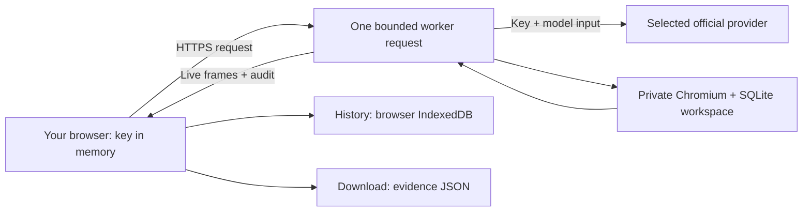

# Relay Live · hosted BYOK

Open **[relay.kevinliu.studio](https://relay.kevinliu.studio)**. Choose **Connect a key**, select **Jev · TypeSafe** or **Ramp Router**, and enter that provider's key. Model discovery uses your account, not a fabricated model list. Select a task, model and interface, then **Run**. A TypeSafe key is sufficient for Jev; no SGLang server, GPU or H100 allocation is required.

The large screen is the agent's actual browser, streamed while it works. It is read-only for the observer. The right panel shows Jev's returned action probabilities or a generative model's recorded actions. Replay, Audit, History and Compare stay out of the workspace until needed.

## Run the same interface locally

```sh
npm ci
npx playwright install chromium
npm run build:hosted
npm run live
```

Open `http://localhost:4340`. This path accepts keys in the UI; it does not load a shared provider key from `.env`. The original local operator lab on port 4330 remains available for larger matrices, CLI runs and raw audit archives. The cloud limits below do not apply to that separately configured local runner.

## Where data goes



- The key is sent to Relay's worker and only the selected provider's fixed official API. It is not a browser-to-provider direct connection. Authentication headers are never recorded in traces, and no key is intentionally written to disk, saved in browser storage or included in downloads. JavaScript memory is not guaranteed to be securely zeroized.
- Reload/disconnect forgets the UI connection. Provider-side revoke/rotation remains your responsibility. A key previously pasted into a conversation should be rotated before continued use.
- History belongs to this browser profile and origin. Other visitors cannot query a shared history endpoint. Clearing browser storage deletes history; another device will not see it. Download important runs.
- Each run owns a random temporary directory, loopback application/control listeners, control secret, SQLite sessions and fresh browser contexts. Normal completion/disconnect closes them and deletes temporary run files. Forced process termination can prevent cleanup; temporary files are not durable storage or a recovery guarantee.
- The observer receives initial/final state and grader results as audit evidence. The model receives only its configured observation interface, not the observer's final audit or control secret.

## Bounds and costs

| Resource                      |             Hosted maximum |
| ----------------------------- | -------------------------: |
| Episodes / run                |                          3 |
| Actions / episode             |                         16 |
| Model calls / run             |                         32 |
| Model-loop time / run         |                150 seconds |
| Episode time                  |                 90 seconds |
| Estimated model spend / run   |                      $0.50 |
| Input allowance / request     | 128,000 conservative units |
| Generated output / request    |               1,024 tokens |
| Concurrent runs / warm worker |                          2 |

The UI starts below these limits. Estimates use the recorded rates, not invoices. Missing usage stays unknown and stops further calls. Set provider-side spend caps. Stopping or losing the connection can leave one already-sent request billable; there are no hidden retries or model substitutions.

**These are not global abuse controls.** Autoscaled workers each have their own concurrency counter. A valid provider key is required before browser allocation, but is not Relay user authentication. The operator still pays hosting compute/egress. Before promoting this beyond a bounded demo, configure hosting spend alerts/limits, global rate limiting or authenticated access, and measure sustained browser load. Those controls are not claimed by this release. The function time limit is 240 seconds; graceful cleanup is attempted before it.

## Deployment and operations

The Vercel project is `relay` in `kl01s-projects`, connected to `Kevin-Liu-01/Relay` on `main`. `vercel.json` builds `build:hosted` and packages a Node 24 function with Chromium. The build preserves `workspace.html` for the private app and makes the public `index.html` the live console; an index-file rewrite alone is insufficient on this deployment.

No shared model secret is deployed. `.env*` (except the example), `.runtime`, `.vercel`, private traces and local reports are excluded from the public repository/archive. Content Security Policy restricts the UI to bundled, same-origin assets and requests. There is no arbitrary upstream URL field or generic proxy.

Before release: `npm run verify`, `npm run test:report`, `npm run evidence`, `npm run package`. After deployment, check the home page in a browser, public config, TLS and a bounded live run. A 200 response alone did not catch the initial wrong-entry-page bug.

The optional `scripts/hosted-smoke.mjs` uses a private `RAMP_ROUTER_API_KEY` environment variable and accepts only the verified Relay production hosts. Its arguments are host, interface and explicitly priced smoke model. Each invocation caps eight calls and $0.10 estimated spend. It saves failures as well as successes under ignored `.runtime/hosted-smokes`; it is not a benchmark campaign.

## What a download proves

Hosted downloads contain structured run/events, the exact prepared request objects, original recorded event hashes, initial/final state, integrity checks, and PNG artifacts. Live JPEG frames are a transient viewing feed, not substituted for hashed policy observations. The hosted JSON is not the local lab's byte-for-byte `.tar.gz` filesystem archive; inventory paths are provenance labels, not publicly retrievable links.

`verified` reports local consistency at capture, not an independent signature or proof against the operator rewriting everything. An interrupted stream may lack the final audit and images; it is saved as incomplete with unknown usage. There is no claim to expose hidden model reasoning.

For scaling, move to a queued worker pool with global admission, per-run leases, encrypted private object storage, authenticated histories, crash cleanup and process-tree resource measurements. Use isolated containers/VMs and network policy before granting policies arbitrary code or shell access. Current browser-context/application isolation is not a hostile-code sandbox.
