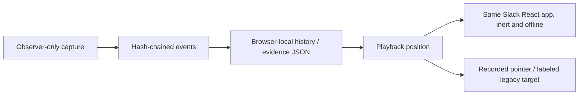

# Replay studio and 1v1 arena

## Try it

The one-pass comparison now has a dedicated [all-trial review surface](https://relay.kevinliu.studio/demo/review.html).
Every published attempt is selectable by model/task and has its own replay and
trace links, including failures and blocks. [Coverage, public-record contents,
original-archive limits and verification](trial-review.md).

**Replays → Watch a topic update** needs no key. Play, pause, change speed, scrub,
or move one action at a time. New browser recordings show actual pointer positions,
with smoothed movement and click feedback. Older captures use a dashed action
target, explicitly **not** a cursor recording. Use the expand icon for a focused
workspace; the live view also supports expand/Escape, with Stop always available.
The reference example is a deterministic script, explicitly not model inference.
Two older real GPT-4o mini recordings retain both a success and a failure.

The onsite campaign adds **GPT-6 Luna · thread reply passed**, **decision record
incomplete**, and **decision record via API**. These are selected original
episodes, not new inference. Each excerpt preserves actions, snapshots, grades and
timestamps and identifies its original run/episode and complete archive hash.
The [full campaign inventory](../evidence/campaigns/onsite-2026-10-01/README.md)
includes all failures and unattempted cells; excerpts are presentation examples,
not a complete success-rate sample. API playback is not GUI-policy evidence.

For a live match, select the task and text interface on the main screen, then
**1v1**. Saved connections and published prices load automatically. Pick two models and choose
**Start 1v1**. A and B can use the same provider/key or separate Ramp/TypeSafe keys.
The main Run settings apply independently to both: the default is $2 per model,
$4 combined. The combined allowance is visible before launch, and is not a charge.
Each side has a fresh workspace, action feed, outcome checks, replay and download.
History keeps two separate runs labeled with the same match ID.

The arena currently supports text interfaces. Jev supports accessibility/page JSON
and excludes free-composition handoff tasks. Pixels remain a solo-run option after
explicit model capability confirmation. A Jev/generative match changes the action
policy as well as the model: it is a system comparison, not a model-only ablation.

## What a replay is

New visually captured runs record a versioned snapshot before each attempted
action, plus a final snapshot when available. It includes actor-visible workspace
data, channel/view, dialogs, thread, search results, drafts, scroll positions and
disclosed target bounds. Capture is an observer artifact; neither the snapshot nor
the hidden grader is added to model input. Snapshots belong to the event hash chain.
Capture adds overhead and bytes; timings are not equivalent to an uninstrumented run.

Playback renders those snapshots through the **actual workspace components** in
`replay.html`, not a second mock UI. It does not re-execute the action or call the
provider. The app's API entry refuses requests in replay mode, the root is inert,
and its Content Security Policy forbids network connections. Parent messages must
come from the same-origin parent window. The public console remains unframeable;
only the replay entry permits same-origin framing.

The iframe's application-ready handshake resends the most recent seek snapshot,
even if the native load event fired first. This closes the early-load delivery
race without polling, replaying actions or making model calls. A deterministic
browser test drops startup messages, seeks to the final recorded state and then
releases the receiver; the final state must arrive after readiness.

New browser runs also hash-chain observer-only `pointer` events: trusted move,
down/up and wheel coordinates, viewport and host receipt time. Move samples are
coalesced to about 31 Hz with the trailing sample retained; clicks flush pending
movement. No DOM content, key text or credentials are collected by this observer.
It does not inject an on-page cursor, change policy observations or add deliberate
input delays. API actions do not invent a cursor; their monitor is not GUI use.

This is still boundary-state playback, not a lossless video or deterministic browser
re-execution. Pointer motion between recorded positions is visually interpolated
over 160 ms, not an assertion of the exact trajectory. Every keystroke, hover style,
selection/caret and animation phase is not recorded. Fill actions may insert a
whole string at once; playback does not fake typing. The currently deployed renderer
can differ from historical CSS. Original PNGs, source hashes and events remain the
fidelity references. Live JPEGs are transient and are not policy observations.

**Smart pace** maps each captured interval to 0.8–2 seconds, slowing very fast
steps and shortening long idle waits. Pointer timestamps are mapped within that
interval. **Recorded timing** uses original capture intervals where present;
legacy missing timing falls back to a disclosed 1.5 seconds. Both hold the final
capture for 1.5 seconds. Playback speed multiplies this presentation clock, never
the reported model latency. Pause/seek are immediate, seeking does not animate a
false trajectory, hidden tabs pause, and changing reduced-motion preference pauses.

Old runs are not backfilled. They show original screenshots at recorded steps and
initial/final state rendered with **UI position not recorded**. Missing UI state is
never described as an exact recording. Interrupted runs can lack final state/audit.
Hash verification is capture-time consistency, not an external authenticity signature.

## What a match result means

Both requests launch concurrently with the same task, seed, interface, guide,
history, action/request/time/input/output limits and per-side spend cap. Sources,
backend/build hashes and initial-state hashes must agree before a winner is shown.
A missing grader receipt, provider error, interruption, budget stop or mismatched
condition is inconclusive—not an automatic loss. A win means one side satisfied
the exact task contract and the other did not. Both can pass or both can fail.

The arena does not rank by speed or cost. Shared worker contention, provider load,
different tokenizers and user-entered price estimates confound those numbers.
One development task is not a benchmark leaderboard or statistical conclusion.
The per-worker admission cap is two; competing requests may be rejected. No retry
or substitute model is silently inserted. Stop both or close the arena to cancel;
already-sent provider calls may remain billable. Keys are not saved with match metadata.
The separate Remember option stores the latest successfully connected key per
provider in localStorage; the arena prefills it without putting it in evidence.
Forget clears the provider's saved copy and matching in-memory lanes. See the
[credential storage contract](hosting.md#where-data-goes) for the unencrypted-storage
tradeoff, opt-out, reload behavior and other-tab limitation.

## Motion and verification receipt

| Change                             | Purpose                                             | Contract                                      |
| ---------------------------------- | --------------------------------------------------- | --------------------------------------------- |
| Prominent action card              | Distinguish deciding, acting, recorded and rejected | Real run events only; no simulated progress   |
| Action/result arrival              | Locate the new decision/outcome                     | 180–220 ms opacity/transform, interruptible   |
| Probability bar change             | Show returned distribution updates                  | 220 ms scale transform, never invented values |
| Dialog arrival and target movement | Preserve visual continuity                          | 160–200 ms; direct keyboard controls          |
| Reduced motion                     | Keep the same information without motion            | Animations/transitions disabled; no autoplay  |

### Live-view and playback motion receipt — 2026-10-01

| Before                                   | After                                                | Why                                                                            |
| ---------------------------------------- | ---------------------------------------------------- | ------------------------------------------------------------------------------ |
| Drop every frame arriving within 220 ms  | 80 ms latest-frame queue, including a trailing flush | A final UI change cannot be dropped just because it arrives during throttling  |
| Replacing images directly                | One decoding image plus one latest pending image     | Keep the previous decoded frame visible; bound memory and prevent decode races |
| Fixed 1.5 s playback steps               | Explicit smart pacing or recorded timing             | Readable actions without presenting compressed waits as measured latency       |
| An animated target mistaken for a cursor | Recorded pointer overlay; dashed legacy target       | Show observed input while labeling interpolation and missing data              |
| Workspace competes with panels           | Expand/Escape focus view, contained full viewport    | See all Slack controls with the same coordinate mapping and accessible Stop    |

Routes: live workspace and Replay studio. Checked at 1440×900, 1920×1080,
800×900 and 390×844; interactive in-app review at its current desktop size.
Owner: `AgentCursor`; occasional move/click feedback uses CSS transform (160 ms,
`cubic-bezier(0.22, 1, 0.36, 1)`) and click-ring opacity/scale (280 ms).
Rapid updates retarget the transition; pause/seek and reduced motion remove it.
Pointer overlays are noninteractive. Focus mode preserves keyboard exit and Stop;
replay controls retain native button/range keyboard behavior and mobile containment.
Live frames are event-driven, capped at 12.5 deliveries/s—not a guaranteed FPS.
A receive-age badge reports old frames instead of claiming a stationary image is
fresh. This does not distinguish a quiet page from a stalled capture connection.
Performance evidence is bounded queue size, CSS-only cursor transforms and browser
regressions, not a sustained cloud throughput measurement.

Committed browser tests exercise real workspace dialogs and typed text, backwards
seek, play/pause/restart, legacy fallback, zero model/API requests during replay,
mobile/reduced-motion layout, matched two-system execution, separate key-free
histories, and replay from a match. Transport fixtures are explicitly fake; they
prove wiring and outcome behavior, not live Jev quality. Unit tests reject
condition/provenance mismatches and missing/failed receipts.

The implementation was also manually exercised through the in-app browser:
opening the library, moving backward/forward, and checking arena setup. The initial
replay overflow was found there and corrected by fitting the workspace to the
available dialog height.

Code: `src/live/{replay,duel,feedback,workspace-view}.jsx`, `playback.mjs`, `duel-policy.js`, `experience.css`,
`src/replay-bridge.js`, `runner/interfaces.mjs`, and `runner/experiment.mjs`.
Refresh only the no-inference example with `node scripts/capture-replay-demo.mjs`
after a build; rebuild hosted assets afterward. Never rewrite historical model runs.
