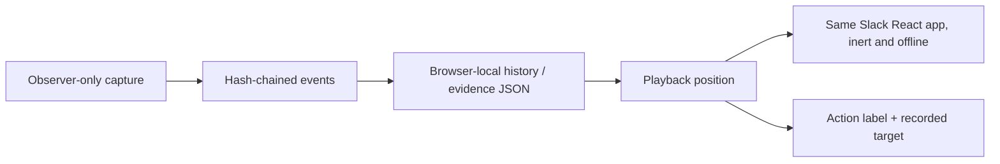

# Replay studio and 1v1 arena

## Try it

**Replays → Watch a topic update** needs no key. Play, pause, change speed, scrub,
or move one action at a time. The purple target marks the next recorded action.
The reference example is a deterministic script, explicitly not model inference.
Two older real GPT-4o mini recordings retain both a success and a failure.

For a live match, select the task and text interface on the main screen, then
**1v1**. Saved connections and published prices load automatically. Pick two models and choose
**Start 1v1**. A and B can use the same provider/key or separate Ramp/TypeSafe keys.
The main Run settings apply to both; the total dollar cap is divided equally.
Each side has a fresh workspace, action feed, outcome checks, replay and download.
History keeps two separate runs labeled with the same match ID.

The arena currently supports text interfaces. Jev supports accessibility/page JSON
and excludes free-composition handoff tasks. Pixels remain a solo-run option after
explicit model capability confirmation. A Jev/generative match changes the action
policy as well as the model: it is a system comparison, not a model-only ablation.

## What a replay is

New visually captured runs record a versioned snapshot before each attempted
action, plus a final snapshot when available. It includes actor-visible workspace
data, channel/view, dialogs, thread, search results, drafts, scroll positions and
disclosed target bounds. Capture is an observer artifact; neither the snapshot nor
the hidden grader is added to model input. Snapshots belong to the event hash chain.
Capture adds overhead and bytes; timings are not equivalent to an uninstrumented run.

Playback renders those snapshots through the **actual workspace components** in
`replay.html`, not a second mock UI. It does not re-execute the action or call the
provider. The app's API entry refuses requests in replay mode, the root is inert,
and its Content Security Policy forbids network connections. Parent messages must
come from the same-origin parent window. The public console remains unframeable;
only the replay entry permits same-origin framing.

This is boundary-state playback, not a lossless video or deterministic browser
re-execution. Cursor positions between boundaries, every keystroke, hover styling,
selection/caret and animation phases are not fully recorded. Playback uses the
currently deployed renderer, so historical CSS can differ. Original screenshots,
build/source hashes and event records remain the fidelity references. Speed means
fixed presentation intervals (1.5 seconds per frame at 1×), not measured model latency.

Old runs are not backfilled. They show original screenshots at recorded steps and
initial/final state rendered with **UI position not recorded**. Missing UI state is
never described as an exact recording. Interrupted runs can lack final state/audit.
Hash verification is capture-time consistency, not an external authenticity signature.

## What a match result means

Both requests launch concurrently with the same task, seed, interface, guide,
history, action/request/time/input/output limits and per-side spend cap. Sources,
backend/build hashes and initial-state hashes must agree before a winner is shown.
A missing grader receipt, provider error, interruption, budget stop or mismatched
condition is inconclusive—not an automatic loss. A win means one side satisfied
the exact task contract and the other did not. Both can pass or both can fail.

The arena does not rank by speed or cost. Shared worker contention, provider load,
different tokenizers and user-entered price estimates confound those numbers.
One development task is not a benchmark leaderboard or statistical conclusion.
The per-worker admission cap is two; competing requests may be rejected. No retry
or substitute model is silently inserted. Stop both or close the arena to cancel;
already-sent provider calls may remain billable. Keys are not saved with match metadata.
The separate Remember option stores the latest successfully connected key per
provider in localStorage; the arena prefills it without putting it in evidence.
Forget clears the provider's saved copy and matching in-memory lanes. See the
[credential storage contract](hosting.md#where-data-goes) for the unencrypted-storage
tradeoff, opt-out, reload behavior and other-tab limitation.

## Motion and verification receipt

| Change                             | Purpose                                             | Contract                                      |
| ---------------------------------- | --------------------------------------------------- | --------------------------------------------- |
| Prominent action card              | Distinguish deciding, acting, recorded and rejected | Real run events only; no simulated progress   |
| Action/result arrival              | Locate the new decision/outcome                     | 180–220 ms opacity/transform, interruptible   |
| Probability bar change             | Show returned distribution updates                  | 220 ms scale transform, never invented values |
| Dialog arrival and target movement | Preserve visual continuity                          | 160–200 ms; direct keyboard controls          |
| Reduced motion                     | Keep the same information without motion            | Animations/transitions disabled; no autoplay  |

Committed browser tests exercise real workspace dialogs and typed text, backwards
seek, play/pause/restart, legacy fallback, zero model/API requests during replay,
mobile/reduced-motion layout, matched two-system execution, separate key-free
histories, and replay from a match. Transport fixtures are explicitly fake; they
prove wiring and outcome behavior, not live Jev quality. Unit tests reject
condition/provenance mismatches and missing/failed receipts.

The implementation was also manually exercised through the in-app browser:
opening the library, moving backward/forward, and checking arena setup. The initial
replay overflow was found there and corrected by fitting the workspace to the
available dialog height.

Code: `src/live/{replay,duel,feedback}.jsx`, `duel-policy.js`, `experience.css`,
`src/replay-bridge.js`, `runner/interfaces.mjs`, and `runner/experiment.mjs`.
Refresh only the no-inference example with `node scripts/capture-replay-demo.mjs`
after a build; rebuild hosted assets afterward. Never rewrite historical model runs.
